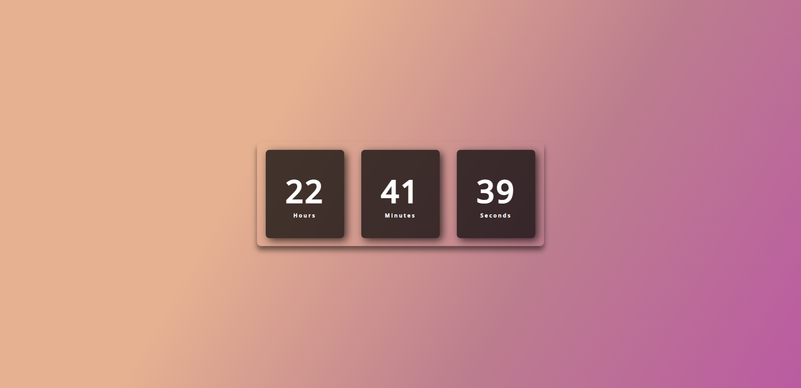
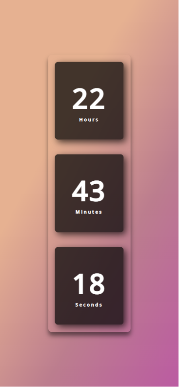

# Digital Clock

Este é um relógio digital simples criado com HTML, CSS e JavaScript.

## Capturas de tela

  
  

  

## Como usar

Basta abrir o arquivo index.html em seu navegador da web. 
Ou acesse diretamente o link do github pages: https://elyssana.github.io/digital-clock/

## Licença

Este projeto está licenciado sob a Licença MIT - consulte o arquivo [LICENSE.md](LICENSE.md) para obter detalhes.
